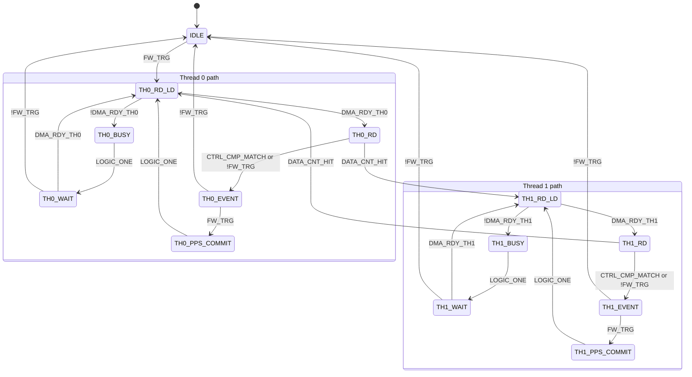

# PLAN — In-band PPS marker via GPIF state machine modification (issue #125)

**Status**: Design complete; awaiting hardware for empirical validation.
**Parent issue**: #125
**Investigation history**: PR #127
**Investigation branch**: `claude/synth-pps-i125`
**Supersedes**: `PLAN_SYNTH_PPS.md` (now obsolete; will be archived)

---

## Why this document exists

The original plan (`PLAN_SYNTH_PPS.md`) proposed a software-only mechanism — a firmware-internal periodic timer driving `CyU3PDmaMultiChannelSetWrapUp()` to force a partial DMA commit, yielding a short USB bulk transfer that the host could detect as an in-band timing marker. Empirical hardware testing during PR #127 has shown this mechanism is unreachable through any SDK-level path.

This document captures:
1. The investigation findings — what was tried, what failed, and why each failure mode rules out a class of solutions.
2. The selected design — GPIF state machine modification, which sidesteps every API-level constraint by putting the commit *inside* the producer's own clocked state machine.
3. Verification work that still needs hardware and tooling to complete.

The goal is durable record: anyone (or any session) picking this up later should be able to read this and proceed without re-running the investigation.

---

## Problem statement

The firmware streams ADC samples over EP1 IN as a continuous bulk pipeline with no in-stream timing reference. Adding an *in-band marker* — a short USB bulk transfer signaling a known sample boundary — enables downstream uses including:

- **Sample-drop detection**: consecutive marker sample-number deltas must equal the configured sample rate ± 0; deviation = drop.
- **Sample-rate verification against an external reference**: when the marker is driven by a GPS-disciplined PPS source, the measured marker interval calibrates the ADC clock.
- **Coarse alignment across multiple receivers**: independent units fed from a common PPS source produce sample streams whose epochs are aligned to within the GPIF synchronizer's ±1 PCLK uncertainty.
- **Traceable recording timestamps**: when paired with a separate UTC-second source, sample positions can be associated with absolute time.

All of these are layered on top of one capability: *forcing a known sample boundary into the streaming data path without disrupting the stream*.

The capability must operate **without observable artifacts in the sample data**. Field testing of the original software-only mechanism showed even tens-of-bytes-per-marker data loss is audible as receiver-side audio artifacts. The bar is zero sample loss between markers.

---

## What was tried during investigation, and why each failed

| Attempt | Mechanism | Failure mode | Evidence |
|---|---|---|---|
| Option 1 | `CyU3PDmaMultiChannelSetWrapUp` from `CyU3PTimer` callback | Returns `CY_U3P_ERROR_MUTEX_FAILURE` (0x1D) on every call | Confirmed via `pps_fail` counter incrementing 20×/2 s, `pps_count = 0`. SDK source review showed the call uses `CYU3P_WAIT_FOREVER` mutex acquisition; the failure is a context constraint (timer-callback context can't block on mutex), not contention. |
| Option 1' | Same with tight retry loop (8 attempts/socket/tick) | Same failure 100% — no retry success | Confirmed `s0=s1=0x1D` after 20 ticks × 16 attempts = 320 attempts, all rejected. Mutex acquisition is context-bound, not timing-bound. |
| Option Y | Low-level `CyU3PDmaSocketSetWrapUp` (bypasses channel mutex) | Bypasses the mutex successfully, but discards the PIB prefetch FIFO contents on commit | `sock_regs.h` `CY_U3P_WRAPUP` bit definition: *"Any remaining data in fetch buffers is ignored, in write buffers is flushed."* The flushed write buffer commits cleanly, but the discarded prefetch buffer produces audible artifacts in receiver audio. |
| Option Z | Convert channel from `AUTO_MANY_TO_ONE` to `MANUAL_MANY_TO_ONE` | CPU bandwidth insufficient | At 128 MB/s sustained (64 MSPS × 2 B/sample), GetBuffer + CommitBuffer round-trip would need ~7,800 callbacks/sec; design target of 270 MB/s (135 MSPS) is out of reach. Even partial-commit semantics in MANUAL mode lose the unsent tail of the buffer, reintroducing the audio-artifact problem. |
| Option 2 | Consumer-suspend dance: `CyU3PDmaMultiChannelSetSuspend(CY_U3P_DMA_SCK_SUSP_CONS_PARTIAL_BUF)` + `CyU3PDmaMultiChannelCommitBuffer(count)` | Same fundamental data-loss issue as Option Y under continuous streaming; complexity (asynchronous event handling) not justified | Bypassed without empirical test — architectural reasoning shows the consumer-suspend mechanism is intended for the case where the consumer can pause naturally; under continuous full-rate streaming the suspend window forces producer backpressure and partial-buffer behavior identical to Option Y. |

### Why API-only approaches fundamentally cannot work

Every SDK-layer commit path acts on the channel or socket *while the producer is actively writing*. The PIB has internal FIFOs (write buffer for committed bytes, prefetch buffer for bytes about to be written) feeding the socket. When the socket commits unexpectedly mid-write, the prefetch FIFO contents are discarded — bounded loss, but non-zero, and audible.

No combination of API calls avoids this: every documented partial-commit path on a continuously-streaming `AUTO_MANY_TO_ONE` channel goes through the same hardware bit (`CY_U3P_WRAPUP`) with the same fundamental side effect.

The only path to zero data loss is to **make the commit atomic with the producer's own clock** — i.e., move the commit decision into the GPIF state machine itself, where the SM controls precisely when the byte boundary is safe.

---

## Selected design: GPIF state machine modification

### Architectural principle

Add new states to the GPIF state machine that execute a `COMMIT` action atomically with `IN_DATA`. The transition into these states is triggered by an external CTL pin (the PPS input). Because the commit happens inside the SM's clocked semantics, there is no in-flight data to discard — every sample is captured into either the marker buffer or the next buffer.

This is the pattern Cypress documents in AN75779 §5.7 for UVC frame-end commit, with one key difference: UVC's frame-valid signal pauses the producer, and the firmware then calls `CyU3PDmaMultiChannelSetWrapUp` from the GPIF callback context (which works because the producer has stopped). Our continuous-streaming case can't rely on producer-stop windows, so we use the SM's own `COMMIT` action — verified to exist in the GPIF II Designer action list — to keep the entire commit decision inside the hardware.

### Hardware design

The board has two unused GPIO pins that are CTL-mappable: `BIAS_HF` (GPIO 19) and `BIAS_VHF` (GPIO 18). Both currently drive bias-T MOSFETs that are not required for the receiver's core function.

- **`BIAS_HF` (GPIO 19)**: reconfigured to GPIF CTL input mode. State machine reads it as the PPS trigger.
- **`BIAS_VHF` (GPIO 18)**: stays in simple GPIO output mode, firmware-driven. Retains its existing role on production hardware.

The FX3 IO matrix supports each pin in either simple-GPIO mode or GPIF mode independently, so the two pins can coexist in different modes.

For **software testing** (no external PPS source available): solder a short jumper wire from the `BIAS_VHF` pin to the `BIAS_HF` pin on the dev board. Firmware toggles `BIAS_VHF` → jumper carries the edge → state machine sees it on `BIAS_HF` → atomic commit.

For **production / external PPS deployment**: do not solder the jumper. Connect an external GPS PPS source (or function generator for bench-bring-up) to the `BIAS_HF` pin. Same state machine, same firmware path; only the driver of the wire changes.

This means **one GPIF state machine design serves both software-testable and production paths** with no firmware mode switching.

### GPIF state machine diff

GPIF II Designer facts verified during investigation:

- `COMMIT` action exists, parameterized by Thread Number. Per the Designer's help text: *"The COMMIT action commits the data packet / buffer on the selected Ingress DMA channel. ... For committing short buffers, this action should be used along with the IN_DATA action."*
- `CMP_CTRL` action with `Change detection` mode arms the control comparator; its output `CTRL_CMP_MATCH` is usable as a transition trigger. This is the GPIF II way to do edge detection — there is no direct `*_POS_EDGE` qualifier.
- Both `CTRL_CMP_MATCH` (comparator output) and the raw level signal `PPS` are available as transition triggers.
- Multiple actions per state are supported. Maximum states: 256.
- **Hard constraint: maximum 2 outgoing transitions per state** (GPIF II Designer User Guide section 4.5).

#### Why the naive "add a third transition" approach fails

`TH0_RD` and `TH1_RD` each already have exactly 2 outgoing transitions in the shipped machine, and so does every other state in the streaming hot loop (`*_RD_LD`, etc.). Adding a third (the PPS trigger) violates the 2-transition limit.

The GPIF II Designer can sometimes auto-resolve >2 transitions via **mirror states** (User Guide section 4.5.1) — but only when the transitions factor cleanly by up to three "global trigger" signals. Our three conditions (`DATA_CNT_HIT`, `!FW_TRG`, PPS) are heterogeneous and do not factor, even when each equation is fully specified with no don't-cares and no OR clauses. The tool returns the generic error *"Unable to synthesize state machine."* Mirror states are not available to us.

The correct mechanism is therefore a manually-inserted **dummy / intermediate state** (User Guide section 4.5.2; AN75779 section 3.6.4 step 21-22, Figures 33-34), which always works for arbitrary transitions at a cost of one cycle of latency on the routed branch.

#### The dummy-EVENT design

Key insight: only `DATA_CNT_HIT` (buffer-full) needs every-cycle evaluation to avoid DMA buffer overrun. The two rare events — PPS edge and soft-stop — share the read state's second exit slot, and a dummy state classifies which one fired.

**New states** (4 total, state count 10 -> 14): `TH0_EVENT`, `TH0_PPS_COMMIT`, `TH1_EVENT`, `TH1_PPS_COMMIT`.

**Existing configuration changes:**
- Add new input signal `PPS` mapped to the GPIF CTL index corresponding to GPIO 19 (`BIAS_HF`). Exact CTL index must be confirmed against the FX3 IO matrix table for the part variant on the board.
- Configure the existing global `CMP_CTRL` comparator: mask = PPS CTL bit, value = 0, mode = Change detection (rising-edge).
- Add `CMP_CTRL` action to `TH0_RD` and `TH1_RD` alpha actions, alongside existing `IN_DATA` and `COUNT_DATA`.

**State actions:**

| State | Actions |
|---|---|
| `TH0_RD` / `TH1_RD` | `IN_DATA`, `COUNT_DATA`, `CMP_CTRL` |
| `TH0_EVENT` / `TH1_EVENT` | `IN_DATA`, `COUNT_DATA` (samples — no dropped data) |
| `TH0_PPS_COMMIT` / `TH1_PPS_COMMIT` | `IN_DATA`, `COMMIT` (thread N) |

**Transition equations (thread 0; thread 1 symmetric):**

| From | Equation | To | Notes |
|---|---|---|---|
| `TH0_RD` | `DATA_CNT_HIT` | `TH1_RD_LD` | buffer full — direct, every cycle, no latency |
| `TH0_RD` | `CTRL_CMP_MATCH \| !FW_TRG` | `TH0_EVENT` | rare event — exit the fast loop |
| `TH0_EVENT` | `!FW_TRG` | `IDLE` | it was a stop |
| `TH0_EVENT` | `FW_TRG` | `TH0_PPS_COMMIT` | else it was PPS -> commit |
| `TH0_PPS_COMMIT` | `LOGIC_ONE` | `TH0_RD_LD` | reuse buffer-prep (DMA-ready + counter reload) |

#### Why this is the smart minimal structure

- **`DATA_CNT_HIT` stays direct on the read state** — evaluated every cycle, zero added latency, no overrun risk, no consumption of the 2-word counter margin (`0x1FFE` = 8190 limit vs. 8192-word buffer).
- **The two rare events share one slot** via the OR. The OR is in a 2-exit state, so it is a plain boolean the hardware evaluates directly — the User Guide section 4.5.1.3 OR-clause warning applies only to states relying on auto-mirror reduction, which this design does not use.
- **`*_EVENT` classifies on `FW_TRG` alone**: the only way to reach it with `FW_TRG` still high is via `CTRL_CMP_MATCH`, so `FW_TRG` high implies PPS implies commit. No need to re-check the comparator edge, which sidesteps the single-cycle edge-persistence problem.
- **`*_EVENT` samples** (`IN_DATA`/`COUNT_DATA`), so the one extra cycle drops no data — this is what avoids the audible artifact. Entered only on PPS-or-stop (rare).
- **Soft-stop preserved from the read state**: `!FW_TRG` still fires from the read state via the OR, routed to `IDLE` through `*_EVENT` one cycle later. A wedged SM stuck in a read state still soft-stops — no wedge-recovery regression.
- **1-cycle latency on the PPS branch only**, within the GPIF synchronizer's inherent +/-1-2 PCLK uncertainty — no marker-accuracy regression.

#### Comparator-mode robustness

If `Change detection` fires only on the rising edge (transition from the configured value 0), `CTRL_CMP_MATCH` alone is the PPS rising-edge signal and the OR stays at 2 triggers. If it fires on both edges, change that arm to `(CTRL_CMP_MATCH & PPS) | !FW_TRG` (3 triggers, still legal) so the `PPS` level selects the rising edge. Either way, exactly one commit per PPS pulse.

### Firmware changes required

Minimal once the SM is regenerated:

- **`SDDC_FX3/radio/rx888r2.c`**: remove `BIAS_HF` from `rx888r2_GpioInitialize()`'s `ConfGPIOsimpleout()` list and from `rx888r2_GpioSet()`'s `CyU3PGpioSetValue()` writes. The pin must be released from simple-GPIO claim so the IO matrix can route it to the GPIF block. `BIAS_VHF` stays as-is (still simple-GPIO output, still firmware-driven).
- **`SDDC_FX3/synth_pps.c`**: `synth_pps_commit_once()` replaces the existing `CyU3PDmaMultiChannelSetWrapUp` calls with two `CyU3PGpioSetValue()` calls on `BIAS_VHF` — drive high, drive low. The state machine on the receiving end (via the jumper wire or external pin) catches the rising edge and executes the commit. The existing diagnostic counters (`glPpsCount`, `glPpsCommitFailCount`, `glPpsLastWrapS0`, `glPpsLastWrapS1`) lose meaning in their old form; the simplest path is to keep `glPpsCount` (increment on each GPIO toggle) and remove the wrap-status diagnostics.
- **`SDDC_FX3/RunApplication.c`** (around line 263): the GPIF stall watchdog hard-codes state numbers `5/7/8/9` (currently `TH0_BUSY/TH1_BUSY/TH0_WAIT/TH1_WAIT`). When new states are added, indices renumber. Replace the magic numbers with symbolic constants from the regenerated `SDDC_GPIF.h`.
- **`SDDC_FX3/SDDC_GPIF/SDDC_GPIF.cyfx`** and `SDDC_FX3/SDDC_GPIF.h`: regenerated by the GPIF II Designer after the SM edit. Both committed together as a single firmware-side change.
- **`SDDC_FX3/StartStopApplication.c:36`**: bump the `glCyFxGpifName` string to indicate new SM variant (e.g., `"HF103_PPS.h"`).

### Why this design is lossless

Each PCLK in the new `TH0_PPS_COMMIT` state executes both `IN_DATA` (sample current data into Thread 0 FIFO) and `COMMIT` (commit Thread 0's buffer to the consumer). The sample sampled at this PCLK is the last sample in the marker buffer; the next PCLK's sample lands in the next Thread 0 buffer.

At no point is there a sample in any FIFO that gets discarded. The hardware completes the current `IN_DATA` write before the `COMMIT` takes effect, and the SM transitions to the next read state before the next sample arrives. The atomicity is guaranteed by PCLK synchronization, not by software coordination.

The bounded data loss documented for `CY_U3P_WRAPUP` (prefetch buffer discard) does not apply because the SM coordinates the commit with the producer's own clock — there is no producer-internal in-flight state when the bit fires.

---

## Open verification items

All require hardware to confirm. The design is robust to either resolution of each item, but knowing the answer eliminates conditional code paths.

1. **Transition priority / OR-clause synthesis** on `TH0_RD`:
   - `DATA_CNT_HIT → TH1_RD_LD` (direct)
   - `CTRL_CMP_MATCH | !FW_TRG → TH0_EVENT` (rare-event branch)

   Build first to confirm the OR-in-a-2-exit-state synthesizes (it should — no auto-mirror reduction is needed when every state is already at or below 2 exits). If both exits are eligible the same PCLK, confirm `DATA_CNT_HIT` wins (buffer-full must not be deferred); a PPS coinciding exactly with a data-counter hit is dropped for that second, which is acceptable (rare marker drop, not data loss).

2. **Change Detection mode semantics**: rising-only (`Value=0` means "was 0, is now non-0") or both-edges (fires on any change). With rising-only the OR arm is `CTRL_CMP_MATCH` alone; with both-edges it becomes `(CTRL_CMP_MATCH & PPS)`. Confirm which, to fix the equation.

8. **`DATA_CNT_HIT` during `*_EVENT`**: the counter advances one unchecked cycle while in the dummy `*_EVENT` state. This is within the 8190 -> 8192 margin, but confirm in simulation that no overrun occurs in the boundary case (PPS firing as the buffer nears full).

9. **Post-commit routing**: `*_PPS_COMMIT → *_RD_LD` reuses the existing buffer-prep (DMA-ready check + `LD_DATA_COUNT` reload). Verify in simulation that the "same thread, next buffer" path is correct, since `*_RD_LD` is normally a thread-*switch* state.

3. **PIB prefetch FIFO behavior with SM-coordinated commit**: confirm empirically (via audio listen-test) that zero data loss is achieved when the commit is triggered by the SM rather than by a CPU API call. Architectural reasoning predicts zero loss; bench verification needed.

4. **CTL pin index for GPIO 19**: confirm from the FX3 IO matrix table for the specific part variant on the board (CYUSB3014 or equivalent). The PPS input signal in the SM must be wired to the correct CTL index.

5. **Marker stability over time**: 1 Hz × 1 hour run; expect consecutive marker sample-number deltas to equal the configured sample rate ± 1 sample (synchronizer jitter floor). Any larger deviations indicate clock issues or sample drops.

6. **Streaming throughput regression check**: confirm that an active PPS-marker run shows no measurable throughput delta vs. baseline (PPS marker idle). Marker rate of 1 Hz emits one short USB transfer per second out of ~7,800 normal transfers/sec at 128 MB/s — should be invisible.

7. **STARTFX3/STOPFX3 interaction**: confirm soft-stop lands cleanly. With the dummy-EVENT design, `!FW_TRG` routes from the read state through `*_EVENT → IDLE` (one cycle later than the old direct exit). Verify STOPFX3's soft-stop still reaches IDLE within its existing wait window, and that a PPS edge arriving during the stop sequence resolves correctly (the `*_EVENT` classifier sends `!FW_TRG` to IDLE, dropping that PPS — acceptable).

---

## Implementation order (when hardware is available)

1. **New branch from `main`** (do not continue `claude/synth-pps-i125`; that branch is the investigation history).
2. **GPIF state machine edit** in the GPIF II Designer (Windows-only Cypress tool):
   - Add `PPS` input signal mapped to the confirmed CTL index for GPIO 19.
   - Configure `CMP_CTRL`: mask = PPS bit, value = 0, mode = Change detection.
   - Add `CMP_CTRL` action to `TH0_RD` and `TH1_RD`.
   - Add four new states (`TH0_EVENT`, `TH0_PPS_COMMIT`, `TH1_EVENT`, `TH1_PPS_COMMIT`) with their actions per the state-action table above.
   - Add the new transitions per the equation table above (read-state OR-branch, EVENT classifier, PPS-commit return).
   - Build to confirm synthesis (no "unable to synthesize"); then Simulate to confirm no overrun and exactly one commit per PPS pulse.
   - Save → regenerate `SDDC_GPIF.h`. Commit `.cyfx` and `.h` together.
3. **Firmware changes** per "Firmware changes required" section above. Single commit alongside the SM regeneration.
4. **Solder jumper** from `BIAS_VHF` pin to `BIAS_HF` pin on the dev board (5 minutes of bench work; reversible).
5. **Flash and test**:
   - `tests/fx3_cmd synth_pps_protocol` — argument validation (carried over from PR #127; unchanged).
   - `tests/fx3_cmd synth_pps_streaming` — verify `pps_count` advances reliably and host sees short URBs at the expected rate.
   - **Audio test**: connect the RX888 to a receiver application, listen during synth-PPS-active streaming, confirm no audible artifacts.
6. **Address open verification items** 1–7 above; document outcomes.
7. **Real-PPS test**: remove jumper, connect GPS PPS or function generator to `BIAS_HF`, repeat tests.
8. **Spectral integrity check**: capture a CW tone, FFT with and without PPS active, confirm no spectral lines at the marker rate or harmonics.
9. **Multi-receiver tests** (if applicable): separate scope, parent issue #125 covers single-receiver acceptance.

---

## What from PR #127 is reusable

The investigation branch contains substantial protocol-surface and tooling work that is **not** invalidated by the mechanism change:

- **`SYNTH_PPS` vendor command (0xB7)** and its three-action semantics (stop / start / oneshot) — unchanged; firmware-side `synth_pps_start/stop/oneshot` calls just drive a GPIO instead of calling DMA APIs.
- **`GETSTATS` extension to 34 bytes** with `glPpsCount` and `glPpsCommitFailCount` counters — the counter semantics adjust slightly (count GPIO toggles instead of SetWrapUp successes/failures), but the wire format and host parsing are unchanged.
- **`do_test_synth_pps_protocol`** — argument-validation matrix; unchanged.
- **`do_test_synth_pps_streaming`** — currently fails because the mechanism doesn't work; expected to pass unchanged once Phase D firmware lands.
- **Documentation**: `docs/api.md`, `docs/architecture.md`, `docs/diagnostics_side_channel.md`, `SDDC_FX3/docs/debugging.md` all updated for the new vendor command and GETSTATS layout — content is correct regardless of mechanism.
- **Instrumentation**: the `glPpsLastWrapS0` / `glPpsLastWrapS1` diagnostic globals can be removed when Phase D lands; they were investigation-only.

The single commit that should be reverted before Phase D merges is the `synth_pps_commit_once()` body that calls `CyU3PDmaMultiChannelSetWrapUp`. The function shape stays; the body changes to GPIO toggle.

---

## Per-CLAUDE.md compliance

- All design rationale and dead-end documentation captured in this single committed markdown file for durability.
- Plan-first discipline preserved: no firmware code authored against the new design until this document is reviewed and approved.
- No new branches created during planning — `claude/synth-pps-i125` remains the active branch for documentation and investigation cleanup; a fresh branch off `main` is recommended for the actual Phase D implementation when hardware is available.
- Functions and tests always together: the protocol test and the streaming test exist and ship together with their respective code; the streaming test simply waits for the mechanism to land.

---

## References

- `SDDC_FX3/SDK/fw_lib/1_3_4/inc/sock_regs.h` — `CY_U3P_WRAPUP` bit definition and prefetch-buffer-discard behavior.
- `SDDC_FX3/SDK/fw_lib/1_3_4/inc/cyu3dma.h` — `CyU3PDmaMultiChannelSetWrapUp` and `CyU3PDmaSocketSetWrapUp` declarations and documented constraints.
- `SDDC_FX3/SDK/fw_lib/1_3_4/inc/cyu3socket.h` — low-level socket APIs documented.
- `SDDC_FX3/SDK/fw_lib/1_3_4/inc/cyu3error.h` — `CyU3PReturnStatus_t` enum (specifically `CY_U3P_ERROR_MUTEX_FAILURE = 0x1D`).
- Cypress AN75779 (FX3 image-sensor / UVC pattern), §4 and §5.7 — DMA channel architecture and the `INTR_CPU` + firmware `SetWrapUp` commit pattern used at frame end. Confirms `COMMIT` is a real GPIF II action but used differently for the UVC bursty-with-stops case.
- FX3 SDK source (`cyu3multichannelutils.c::CyU3PDmaMultiChannelSetWrapUp`) — confirms the channel-level call acquires its mutex with `CYU3P_WAIT_FOREVER` before calling `CyU3PDmaSocketSetWrapUp`, explaining why timer-callback context returns `MUTEX_FAILURE`.
- Issue #125 (parent feature request).
- PR #127 (investigation history, instrumentation, protocol surface).
