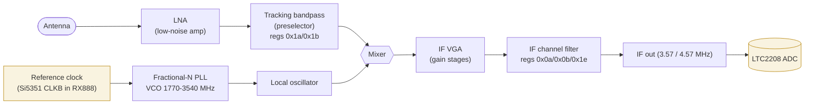
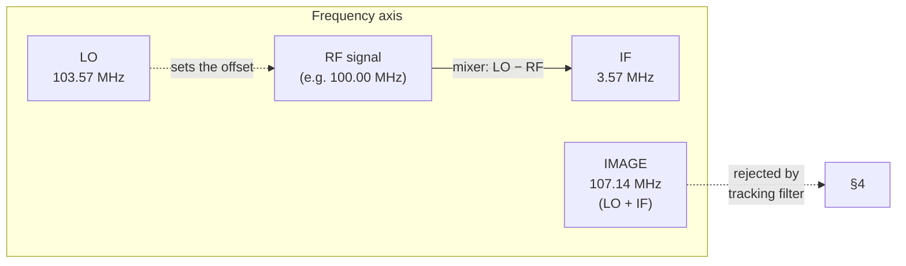
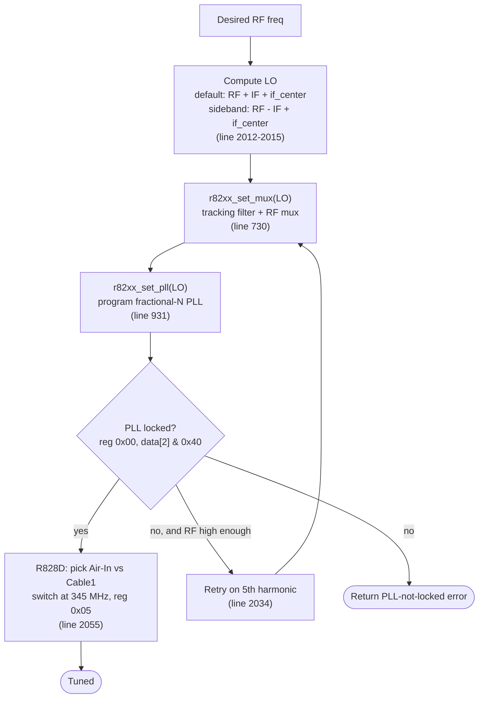
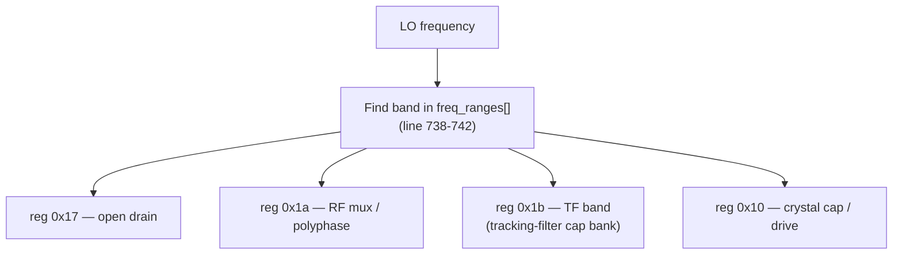
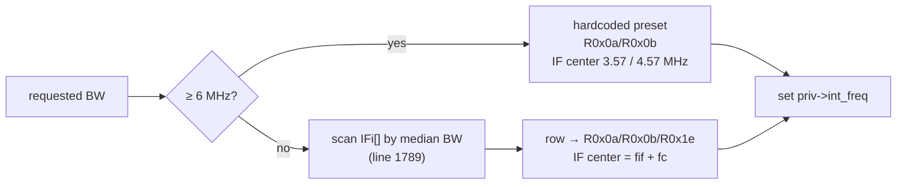
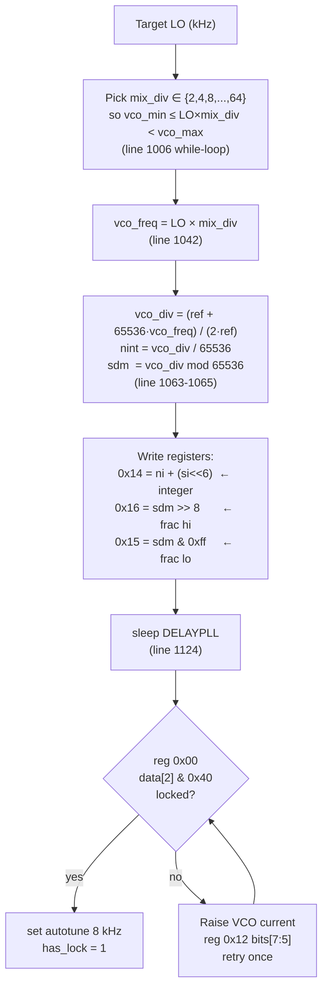
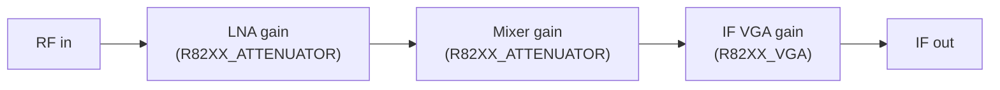
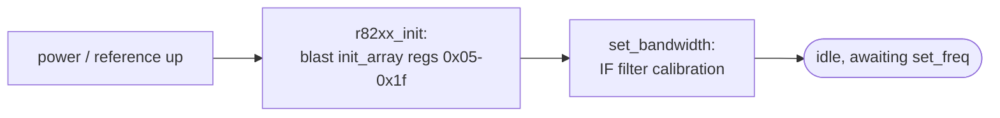
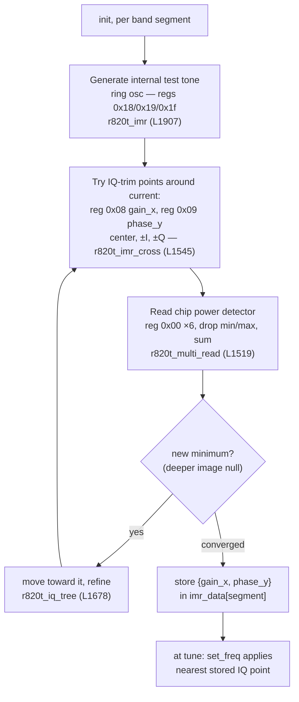

# How the R820T2 / R828D Tuner Works

A walk-through of the Rafael Micro **R820T2 / R828D** silicon tuner as actually
driven by the old `SDDC_FX3/driver/tuner_r82xx.c` driver (first added in
commit `74253a4`, with the same LO logic still present in commit `0ffa512`).
The line numbers below refer to that historical driver, not to files currently
checked out in this repo.

The chip is a **superheterodyne front-end on a die**: it slides any RF signal
down to one fixed intermediate frequency (IF) that the ADC then samples.
Everything is configured over I2C through ~32 registers (`0x00`–`0x1f`);
`0x00`–`0x04` are read-only status (PLL lock, VCO fine-tune), the rest control.

---

## 1. Signal path



The two highlighted blocks are **off the tuner die**: the reference clock comes
from the Si5351 (CLKB), and the IF lands in the RX888's ADC. Everything between
is on-chip and set over I2C.

Key fact: the mixer output contains the difference product, so the wanted RF
lands at the IF when either `LO = RF + IF` (default/high-side injection) or
`LO = RF - IF` (low-side injection). The IF value is whatever the channel filter
selects (§5): the chip default is `R82XX_IF_FREQ = 3.57 MHz`, but **this
firmware's 8 MHz filter setting puts it at 4.57 MHz**.

---

## 2. The superheterodyne relationship



The caller passes an RF frequency into `r82xx_set_freq64`, but the tuner PLL is
programmed with a computed **LO**. From `r82xx_set_freq64` (line 1992):

```c
if (priv->sideband ^ harm_sideband_xor[priv->tuner_harmonic])
    lo_freq = freq - priv->int_freq + priv->if_band_center_freq;
else  // sideband flips on odd harmonics
    lo_freq = freq + priv->int_freq + priv->if_band_center_freq;
```

- `priv->int_freq` = the IF (3.57 MHz default; **4.57 MHz** with this
  firmware's 8 MHz filter — §5). The worked numbers above use the 3.57 default.
- `priv->sideband` chooses high-side vs low-side LO injection (flips the spectrum).
  In the default path (`sideband == 0`, non-harmonic), the LO is **above** RF.
  In the other path, the LO is **below** RF.
- `priv->if_band_center_freq` is an additional center-offset term and is added
  in both branches; it is not independently signed by the sideband setting.
- The **image** is on the opposite side of the LO from the wanted signal. For
  default high-side injection (`LO = RF + IF`), the image is at `LO + IF`; for
  low-side injection (`LO = RF - IF`), the image is at `LO - IF`. The tracking
  filter (§4) exists to suppress that opposite-side response.

---

## 3. Tuning control flow

What happens on one `r82xx_set_freq64()` call (line 1992):



The **harmonic retry** is how the chip reaches above its native VCO/mixer
ceiling: above a threshold it tunes the LO to `LO/5` and uses the 5th harmonic
of the mixer (`lo_freqHarm = lo_freq / harm`, line 2022).

---

## 4. The tracking filter — why `freq_ranges[]` exists

A mixer also responds to the opposite-side **image** (`LO + IF` for the default
high-side case, `LO - IF` for low-side) and to strong out-of-band
signals, so the chip carries an on-chip bandpass that must **move with the
tuning**. `r82xx_set_mux` (line 730) looks the LO up in `freq_ranges[]`
(line 370) and programs the band:



Each `freq_ranges[]` entry is `{ start_freq, open_d, rf_mux_ploy, tf_c,
xtal_caps... }`. As you tune, a different capacitor bank (`tf_c`) is switched in
so the RF bandpass stays centered on the wanted signal.

> This is exactly why "tune by moving the reference clock only" (Model 2 in the
> VHF plan) degrades image rejection: it shifts the LO **without** re-running
> `set_mux`, so the tracking filter stays parked on the wrong band.

### Tracking-filter band table (`freq_ranges[]`, line 370)

The LO frequency selects a row; `tf_c` is the tracking-filter capacitor bank
(reg `0x1b`) and shrinks as the LO climbs (smaller cap → higher resonance).
Above ~310 MHz the RF mux switches from the LPF to **bypass**.

| LO band ≥ (MHz) | `tf_c` (R`0x1b`) | RF mux (R`0x1a`[7:6]) | poly (R`0x1a`[1:0]) | open-drain (R`0x17`) |
|---:|:---:|:---:|:---:|:---:|
| 0   | `0xDF` | LPF | low | low |
| 50  | `0xBE` | LPF | low | low |
| 55  | `0x8B` | LPF | low | low |
| 60  | `0x7B` | LPF | low | low |
| 65  | `0x69` | LPF | low | low |
| 70  | `0x58` | LPF | low | low |
| 75  | `0x44` | LPF | low | high |
| 80  | `0x44` | LPF | low | high |
| 90  | `0x34` | LPF | low | high |
| 100 | `0x34` | LPF | low | high |
| 110 | `0x24` | LPF | low | high |
| 120 | `0x24` | LPF | low | high |
| 140 | `0x14` | LPF | low | high |
| 180 | `0x13` | LPF | low | high |
| 220 | `0x13` | LPF | low | high |
| 250 | `0x11` | LPF | low | high |
| 280 | `0x00` | LPF | low | high |
| 310 | `0x00` | **bypass** | middle | high |
| 450 | `0x00` | **bypass** | middle | high |
| 588 | `0x00` | **bypass** | highest | high |
| 650 | `0x00` | **bypass** | highest | high |

---

## 5. The IF channel filter — bandwidth options (`r82xx_set_bandwidth`, line 1759)

After the mixer, the chip has a **configurable IF channel filter** that sets
how wide a slice survives around the IF center. Two things to know:

1. **The IF center is *not* fixed** at the chip's `R82XX_IF_FREQ` (3.57 MHz)
   default — `set_bandwidth` overwrites `priv->int_freq` from the chosen filter
   row. **This firmware calls it with 8 MHz**
   (`r82xx_set_bandwidth(&tuner, 8*1000*1000, …)` in the old USBhandler), which
   lands the IF center at **4.57 MHz**, not 3.57.
2. Wide bandwidths (≥6 MHz) are hardcoded; narrower ones come from the `IFi[]`
   table (line 1669), and there the IF center = `fif + fc` and shifts per row.

### Wide presets (hardcoded, top of `set_bandwidth`)

| Requested | Applied BW | R`0x0a` | R`0x0b` | **IF center** |
|---:|:---:|:---:|:---:|:---:|
| > 7 MHz | 8 MHz | `0x10` | `0x0b` | **4.57 MHz** ← used by this firmware |
| > 6 MHz | 7 MHz | `0x10` | `0x2a` | 4.57 MHz |
| > 4.5 MHz | 6 MHz | `0x10` | `0x6b` | 3.57 MHz |

### Narrow steps (`IFi[]`, "centered" rows; IF center = `fif + fc`)

| 3-dB BW (kHz) | IF center (kHz) | R`0x0a` | R`0x0b` | R`0x1e` |
|---:|---:|:---:|:---:|:---:|
| 290  | 1925 | `0x0F` | `0xE7` | `0x00` |
| 375  | 1857 | `0x0F` | `0xE8` | `0x00` |
| 420  | 2121 | `0x0F` | `0xD7` | `0x00` |
| 470  | 1788 | `0x0F` | `0xE9` | `0x00` |
| 600  | 1706 | `0x0F` | `0xEA` | `0x00` |
| 860  | 1558 | `0x0F` | `0xEB` | `0x00` |
| 950  | 2205 | `0x0F` | `0x88` | `0x00` |
| 1100 | 2125 | `0x0F` | `0x89` | `0x00` |
| 1200 | 1350 | `0x0F` | `0xEE` | `0x00` |
| 1300 | 2043 | `0x0F` | `0x8A` | `0x00` |
| 1500 | 1276 | `0x0F` | `0xEF` | `0x60` |
| 1600 | 1900 | `0x0F` | `0x8B` | `0x00` |
| 1750 | 1412 | `0x0F` | `0xCF` | `0x60` |
| 1800 | 1400 | `0x0F` | `0xAF` | `0x00` |
| 1950 | 1530 | `0x0F` | `0x8F` | `0x60` |
| 2200 | 1600 | `0x0F` | `0x8F` | `0x00` |
| 3000 | 2000 | `0x04` | `0x8F` | `0x00` |
| 5000 | 3570 | `0x0B` | `0x6B` | `0x00` |

> `R0x0a` low nibble + `R0x0b` set the filter corner/Q; `R0x1e` (`0x60`) enables
> the "filter extension on weak signal." When `WITH_ASYM_FILTER` is compiled in,
> each row also gets steep-low / steep-high **asymmetric** variants
> (`sharpCorner` 1/2, via the `IFA()`/`IFB()` macros) for single-sideband use —
> those are the `r82xx_set_sideband` (reg `0x07` bit 7) companions.



---

## 6. Fractional-N PLL — how the LO is synthesized

The core of `r82xx_set_pll` (line 931). The VCO only runs **1770–3540 MHz**
(`vco_min`, `vco_max`), so the LO is the VCO divided down:



The synthesized LO is therefore:

```
            2 · ref · (nint + sdm/65536)
   LO  =  ───────────────────────────────
                     mix_div
```

where `ref = priv->cfg->xtal` — **the external reference clock**. In the RX888
that reference is the **Si5351 CLKB output**. So:

- The integer `nint` (8-ish bits) sets the coarse step; the 16-bit `sdm`
  sigma-delta value fills in the fraction → very fine resolution.
- **Every bit of LO accuracy rides on `ref`.** Control the Si5351 precisely and
  the whole equation is deterministic — which is the entire reason for the
  "know the exact frequency via the clock" discussion.
- If the VCO won't lock, the driver **raises VCO bias current** (reg `0x12`)
  and retries — an autonomous calibration, not a host concern.

---

## 7. Gain stages

Three independent gain blocks, each its own I2C control (mapped to the old
firmware's `SETARGFX3` sub-commands):



Each can run in auto (AGC) or manual mode; `set_all_gains` / `set_vga_gain`
walk gain-index tables to register values.

### Register map (bench-confirmed on RX888 mk2)

| Stage | Reg | Gain bits | Range | AGC bit | Init default |
|-------|-----|-----------|-------|---------|-------------|
| LNA   | `0x05` | `[3:0]` | 0–15 | bit 4 (1 = auto) | gain = 0, AGC **off** |
| Mixer | `0x07` | `[3:0]` | 0–15 | bit 4 (1 = auto) | gain = 0, AGC **on** |
| IF VGA | `0x0C` | `[3:0]` | 0–15 | — | gain = 11 |

> **Note:** the init array (`r82xx_init_array`, reg `0x07` = `0x70`) sets mixer
> AGC **on** by default — the chip controls mixer gain itself until the host
> explicitly clears bit 4. LNA AGC is off (reg `0x05` = `0x80`, bit 4 = 0).
> VGA has no AGC bit; its gain is always manual.
>
> Other bits in these registers have unrelated roles: `0x05` bits `[6:5]`
> select Air-In vs Cable1 (switched at 345 MHz by `set_freq64`), and `0x07`
> bit 7 is the sideband select (§5). The gain and AGC bits do not collide
> with those — masked writes (`_wr_mask`) keep them independent.

---

## 8. Boot / init

`r82xx_init` (line 2132) writes `r82xx_init_array[]` (line 330) — ~27 bytes of
sane defaults for regs `0x05`–`0x1f` — then runs `set_bandwidth` to calibrate
the IF channel filter. After that the chip is idle until the first
`set_freq64`.



---

## 9. Bonus: image-rejection (IMR) self-calibration

> **Not in this repo's `tuner_r82xx.c`** — the librtlsdr lineage omits it.
> This lives only in the **Linux kernel** driver
> (`drivers/media/tuners/r820t.c`); line numbers below cite that file. It is
> called out here because it's a real chip capability the SDR drivers drop,
> and it ports to a **host-side** driver over the I2C passthrough with **zero
> firmware change** — a concrete opportunity for the VHF work.

The static tracking filter (§4) only *partially* suppresses the image at
`LO + IF`. The R820T/R828D also has an on-chip **IQ-mismatch trim** that can
actively null the image — but it must be calibrated. The clever part: the chip
self-calibrates using **its own internal test tone and its own power detector**,
so no external signal generator is needed. Three on-chip ingredients:

| Role | Mechanism | Registers | Linux fn |
|---|---|---|---|
| **Test tone** | internal ring oscillator, set to a known freq per band segment | `0x18` / `0x19` / `0x1f` | `r820t_imr` (L1907) |
| **Detector** | read status 6×, drop min+max, sum → denoised image-strength number | `0x00` | `r820t_multi_read` (L1519) |
| **Trim knobs** | I/Q amplitude (`gain_x`) and I/Q phase (`phase_y`) | `0x08` / `0x09` | `r820t_imr_cross` (L1545) |

The calibration loop (`r820t_imr_cross` → `r820t_iq_tree` L1678 → `r820t_iq`
L1824), run per band segment and cached in `imr_data[]`:



Orchestrated at init by `r820t_imr_callibrate` (~L2059), which also runs an
**xtal-cap check** (`r820t_xtal_check`) to pick crystal loading; the whole pass
is gated by the `no_imr_cal` module param.

**Why it's a clean host-side port (no firmware change):** every step is an I2C
read or write — ring-osc regs, the `0x00` detector read, the `0x08`/`0x09` trim
regs. The chip is *both* the signal source and the meter, so a host driver can
run the entire sweep over `I2CWFX3`/`I2CRFX3` at startup, cache `imr_data[]`,
and apply the nearest point per tune. Cost: a slow one-time init sweep; benefit:
active image rejection beyond the static filter — meaningful for weak-signal
VHF near strong signals. (GPL-2.0, but fine host-side.)

---

## 10. Standby — power-down sequence (`r82xx_standby`)

`r82xx_standby` (librtlsdr) writes 11 registers to power down every major
block, front-to-back. The order matters: the PLL / LO goes first (so the
mixer stops producing IF), then the signal-path blocks shut down from
antenna to output, then auxiliary circuits (ring oscillator, open drains).

| Order | Reg | Value | What it powers down |
|:-----:|-----|:-----:|---------------------|
| 1 | `0x06` | `0xB1` | **PLL / LDO** — kills the local oscillator and internal power rails |
| 2 | `0x05` | `0xA0` | **LNA** — bit 5 added to init `0x80` powers down the low-noise amp |
| 3 | `0x07` | `0x3A` | **Mixer** — mixer power-down, gain zeroed |
| 4 | `0x08` | `0x40` | **Image-reject gain** — I/Q amplitude trim amplifier off |
| 5 | `0x09` | `0xC0` | **Image-reject phase** — I/Q phase trim amplifier off |
| 6 | `0x0A` | `0x36` | **IF channel filter** — filter power-down |
| 7 | `0x0C` | `0x35` | **IF VGA** — variable-gain amplifier stages off (upper bits cleared) |
| 8 | `0x0F` | `0x68` | **Ring osc power** — same as init; ensures known state after IMR cal |
| 9 | `0x11` | `0x03` | **Loop-through / ring power** — nearly all bits cleared |
| 10 | `0x17` | `0xF4` | **Open-drain outputs** — tracking-filter outputs to safe / high-Z |
| 11 | `0x19` | `0x0C` | **Ring osc clock** — bits 7,6,5 cleared, ring oscillator clock off |

Bring-up is the reverse: `r82xx_init` blasts the init array (§8), which
restores power to all blocks, then `set_bandwidth` and `set_freq` configure
the signal path. Teardown order mirrors this — you wouldn't want the VGA
amplifying noise from a mixer whose LO just went dark.

> In `rx888_vhf.py` / `vhf_tune.py`, the `standby()` lifecycle method goes
> further: after the R828D register sequence it also turns CLKB off (Si5351
> CLK2 power-down) and restores the HF GPIO (clear `VHF_EN`, set `BIAS_HF`).
> Each step is best-effort so a failure in one doesn't prevent the others.

---

## Register cheat-sheet (the load-bearing ones)

| Reg | Role | Set by |
|-----|------|--------|
| `0x00`–`0x04` | **Read-only status** — PLL lock (`data[2] & 0x40`), VCO fine-tune. Reads are bit-reversed from the datasheet's logical order (note below); reg `0x01` is datasheet-"reserved" but carries live status on the bench | read in `set_pll` |
| `0x05` | **LNA**: gain `[3:0]` (0–15), AGC bit 4, Air-In/Cable1 `[6:5]` | `init`, `set_freq64`, `set_all_gains`, `standby` |
| `0x06` | PLL / LDO power control | `init`, `standby` |
| `0x07` | **Mixer**: gain `[3:0]` (0–15), AGC bit 4, sideband bit 7 | `init`, `set_sideband`, `set_all_gains`, `standby` |
| `0x0a`/`0x0b` | **IF channel-filter** bandwidth / corner | `set_bandwidth`, `standby` |
| `0x0c` | **IF VGA** gain `[3:0]` (0–15); upper bits power stages | `init`, `set_vga_gain`, `standby` |
| `0x0e` | mixer AGC threshold | `set_bandwidth` |
| `0x1e` | IF filter extension "on weak signal" (`0x60`) | `set_bandwidth` |
| `0x10` | Reference divider, crystal cap, PLL divider (`div_num`) | `set_mux`, `set_pll` |
| `0x12` | **VCO current** (bits 7:5), dither/SDM power | `set_pll` |
| `0x14` | PLL integer `nint` → `ni + (si<<6)` | `set_pll` |
| `0x15`/`0x16` | PLL fractional `sdm` (lo / hi byte) | `set_pll` |
| `0x1a` | PLL autotune bw; **RF mux / polyphase** | `set_pll`, `set_mux` |
| `0x1b` | **Tracking-filter band** (`tf_c`) | `set_mux` |
| `0x17` | Open-drain | `set_mux` |
| `0x08`/`0x09` | IQ trim — image-reject gain / phase | *Linux IMR only (§9)* |
| `0x18`/`0x19`/`0x1f` | Internal ring-oscillator test tone (cal) | *Linux IMR only (§9)* |

> **Read bit-order (bench fact).** The R828D streams *reads* LSB-first but takes
> *writes* MSB-first (Rafael "R820T2 Register Description"), so a standard I2C
> master receives every read byte **bit-reversed** from the datasheet's logical
> numbering. Proven on RX888 hardware: reg `0x00` reads wire `0x69` =
> bit-reverse of the datasheet's logical `0x96`, and writing init `0x13` to reg
> `0x06` reads back `0xC8` (and `0xC0`→`0x03`, `0xBB`→`0xDD`, `0x30`→`0x0C`).
> librtlsdr and `vhf_tune.py` bit-reverse reads to recover logical order (so the
> lock test `data[2] & 0x40` is logical reg `0x02` bit 6 = the VCO_INDICATOR
> MSB); raw tools like `r828d_probe.py` leave reads wire-order and label them.
> Separately, the datasheet-"reserved" reg `0x01` is **not** static padding — on
> the bench it changes on lock (`0x01`→`0x61` wire), i.e. a live status register
> the datasheet doesn't document.

---

### One-line summary

> A moving RF bandpass + a divided-down fractional-N LO + a fixed mixer, all
> poked through ~30 I2C registers, dropping everything to a fixed IF (4.57 MHz
> as this firmware sets it) for the ADC — and the only knob that *isn't* on the
> chip is the reference clock (Si5351 CLKB).
